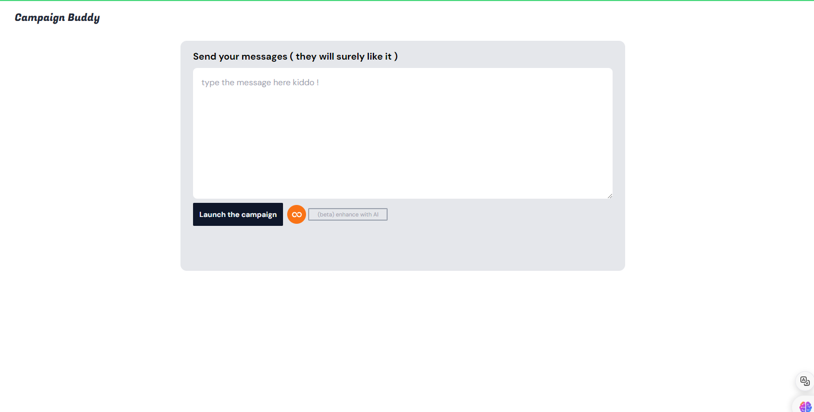

# Campaign-Buddy 

This application allows users to compose, enhance, and send text messages using Orange Côte d'Ivoire's SMS API. The user interface is built with React.js and styled using Tailwind CSS.

## Table of Contents

- [Features](#features)
- [Technologies Used](#technologies-used)
- [Installation](#installation)
- [Usage](#usage)
- [Interface](#interface)

## Features

- **Text Input**: Users can type messages into a text area.
- **Text Enhancement**: Uses an AI service to enhance and rephrase the input text.
- **Loader Animation**: Displays a loader animation during the text enhancement process.
- **SMS Campaign**: Sends the enhanced text messages using Orange Côte d'Ivoire's SMS API.

## Technologies Used

- **React.js**: For building the user interface.
- **Tailwind CSS**: For styling the application.
- **smsorange**: A library for interacting with Orange Côte d'Ivoire's SMS API.

## Installation

1. Clone the repository:

   ```sh
   git clone https://github.com/Alhassan-Doumbia/Campaign-buddy.git
   cd Campaign-buddy
2. Install the dependencies 

    ```sh
    npm install
3. Set up environnement Variables : 
    Create a .env file in the root directory and add your API keys:
    ```sh
    REACT_APP_AI_API_KEY=your-ai-api-key
    REACT_APP_ORANGE_SMS_API_KEY=your-orange-sms-api-key

### Usage
1. Start the development server:

    ```sh
    npm start

2. Open your browser and navigate to http://localhost:3000.

3. Type your message in the text area, enhance it using the AI service, and send it via SMS.

### Interface 
 

